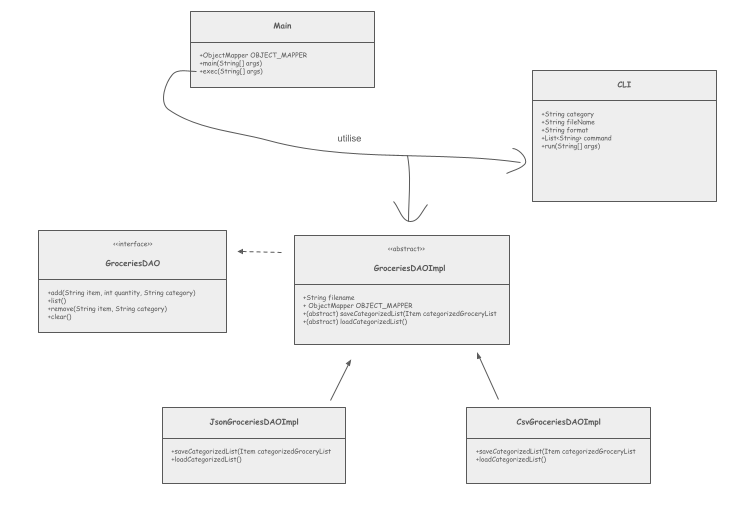

# 1) Implementation Details

* In order to have a more scalable system to read and write to our grocery list, we have implemented 
a **data access object (DAO)** design pattern.
* The interface for this **DAO** contains the methods for **adding, listing, removing items, and clearing the list.**
It is named ``GroceriesDAO``. We have an abstract class implementing it named ``GroceriesDAOImpl``. We have two
classes extending it, named ``JsonGroceriesDAOImpl`` and ``CsvGroceriesDAOImpl``.
* We might have also used a **component** design pattern for running the command line interface and storing the
arguments. This class is named ``CLI``.

# 2) Technical Challenges

* The first difficulty was figuring out how to not have the main run all the command line stuff. We created
a ``CLI`` stuff that would both run it and store the arguments. One of the challenged that came out of this
was handling passing down the Exceptions (ParseExceptions) back to the ``exec`` method of the ``Main`` class so it
could return 0 or 1 depending on if everything went well or not.
* The second difficulty was implementing the DAO for the grocery list. It was obvious that we had to use this design
pattern. But since we have multiple file formats to store the list (JSON and CSV), implemening SOLID principles was
hard. We didn't want to have a DAO class that would contain the saving and loading mechanism for all file formats.
But we didn't want to repeat the same add, list, remove, and clear methods in the DAOs for each file format.
This was our solution:
    * The class implementing this DAO contains the members ``String filename`` and an ``ObjectMapper OBJECT_MAPPER``
      to execute these operations to the correct file. These members ``final``, ensuring that the **DAO** is in fact stateless.
    * This class also includes methods to save and load grocery lists to memory, respecfully named ``saveCategorizedGroceryList``
      and ``loadCategorizedGroceryList``
    * However, the saving and loading is different depending on whether we are dealing with the JSON or CSV versions of the lists.
      Therefore, we made this class abstract, and made ``saveCategorizedGroceryList`` and ``loadCategorizedGroceryList`` abstract,
      so that they can be filled in by seperate **DAO** classes that extend it, one class for each file type, so 2 of them for JSON and CSV.
    * We named these ``JSONGroceriesDAOImpl`` and ``CSVGroceriesDAOImpl``

# 3) Schema

