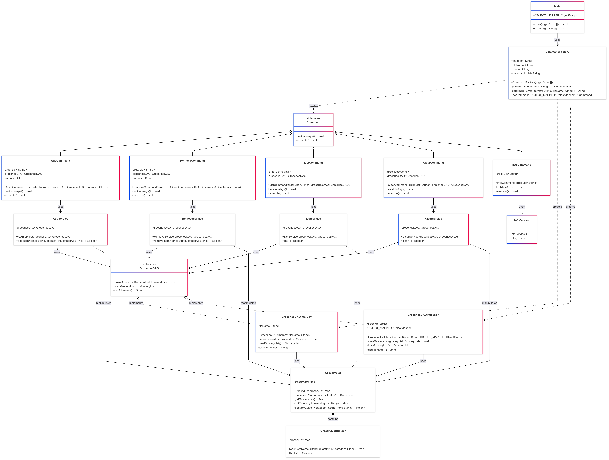

# 1) Implementation Details

* Last time, our DAO wasn't a pure DAO, it was a mix of a DAO and a service. We have separated the two concerns.
Now, the DAO is only responsible for the data access and the service is responsible for the implementation details of the commands.
* We have created a module called GroceryList. This way, we can load the grocery list from a file and save it to a file more easily,
as well as handling any algorithmic operations on the grocery list.
* We have removed the CLI class that parsed the command line arguments.
We have instead created a CommandFactory class that creates the commands based on the command line arguments.
Every command is now a class that implements the Command interface. They can all validate the arguments and execute the command.
* We have created a service class for each command. Once the command is executed, it will call the service class to execute the command.
* The main is now very small.

# 2) Technical Challenges

* The way to parse the command line arguments was challenging. With the introduction to the new "info" command,
we had to make every command line option (-s, -f etc) optional.
* Then, we had to make sure that the command line arguments were passed to the correct command if needed by the command.

# 3) Schema

