May 2025

TP 4 - Final Report

Toby Pollock  
Tom Huguet  
Maxence Martin

## 1) What we didn't have time for

* We did not separate argument parsing from command instantiation, violating the single responsibility principle.
  The CommandFactory class handles both, but it would have been better to have an intermediate class just for parsing.
* Our DAO interface only has the methods `save` and `load`. For better time complexity, we could have
  added more methods, such as methods that add or remove a single object from the source, instead of completely
  overwriting the source
  when saving.
* We did not enforce a specific design architecture, such as MVC or Hexagonal Architecture,
  which could have improved the separation of concerns and maintainability of the code.
  Our packages are organized by functionality, but it resembles Hexagonal Architecture due
  to the separation of the domain and the infrastructure.

## 2) What was challenging

* The main challenge was learning and choosing the right design patterns to make the program
  extensible and maintainable. But we never had problems with the architecture being
  too complex; the more design patterns we used, the easier it was to understand the code.
* We challenged ourselves to use our (superb) architecture to implement a MySQL data source,
and to implement a clear grocery list command.
* * Clear command usage example: `-f json -s groceries.json clear`
* * MySQL data source usage example: `-f mysql -s jdbc:mysql://localhost:3306/groceries web 8080`

## 3) The design patterns we used

We used:
* **DAO pattern** to separate data access logic from business logic, and to change the data source without affecting the rest of the code.
* **Service pattern**, making new functionalities easier to add without modifying existing code.
* **DTO pattern** to simplify parameter passing in Services and to make the code cleaner.
* **Command pattern** add new terminal commands easily, and customise the argument validation
and execution.
* **Factory pattern** to create Command objects and DAO objects. These essentially made the code cleaner,
  defining a specific place to create these Command and DAO objects. The DAO Factory was needed for factorisation, since
each implementation of a Command creates a DAO object.
* **Builder pattern** to create instances of our GroceryList module. It made the code cleaner and easier to read
when creating instances of the GroceryList module, especially for the unit tests. We also have a **factory method** to create
the instances of GroceryList, which is a bit redundant, and it's not as easy to read, but it was already implemented and
we didn't want to change it.

## 4) Questions
### _a) How can I add a new command (in theory, no code)?_
* Create a new class that inherits from the Command class.
Implement what arguments and options are required for the command.
Implement what the command does (typically call an associated service class).
* Update the CommandFactory class to return an instance of the new command instance.
* (Optional but recommended) Create the Service associated with the command. Use a DTO to pass the arguments
  to the Service, and implement the logic of the command in the Service class.

### _b) How can I add a new data source (in theory, no code)?_
* Create a new DAO class that inherits from the GroceriesDAO interface.
Implement how to save and load the data from the new data source.
* Update the GroceriesDAOFactory so it returns an instance of the DAO for the new format.

### _c) What must I change if I want to specify a store where I can add my groceries (in theory, no code)?_

* Update our GroceryList module to include a store attribute.
* Update the logic of all DAO implementations to include the store attribute when loading and saving the data.
* Update the logic all Services and their DTOs to take into account the store attribute.

This is good enough when using the Services from an interface that considers the store attribute.
But we should make the command line interface consider the store attribute as well.

* Update the CommandFactory to include a --store option for the command line interface.
* Update the argument validation and execution methods of the implementations of the Command class.

## 5) Schema

